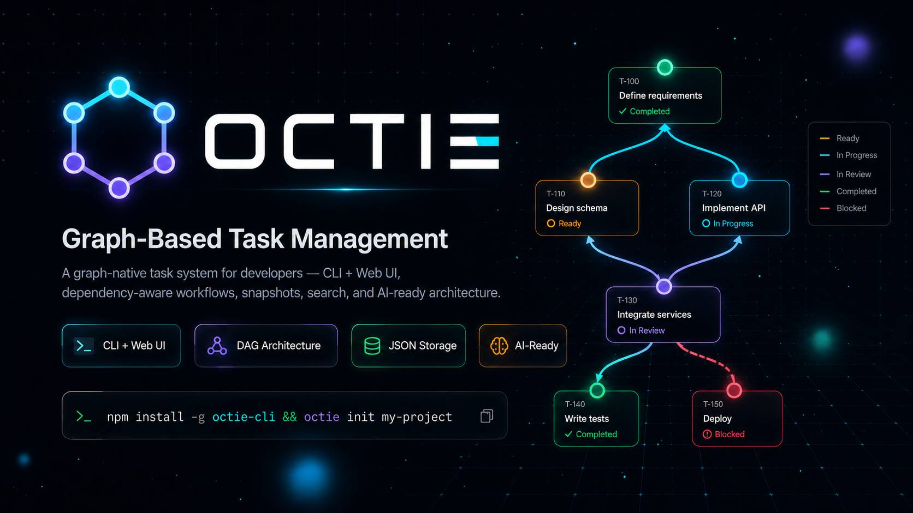

# Octie

<p align="center">
  
</p>

Octie is a state-oriented project management framework built for the agent era. As AI agents scale from minute-long tasks to day-long autonomous operations, teams face three systemic crises: **context rot** that buries critical instructions in long conversations, **missing harnesses** that prevent agents from acting on their environment, and **state fragmentation** that forces every new session to start from zero. Octie solves this by treating multi-agent workflows as a **DAG state machine**—where task dependencies become state propagation channels, status is **derived via an embedded engine** rather than manually edited, and **atomic validation** blocks vague tasks at the architecture level before they ever reach an agent. State changes **auto-propagate via BFS** across the dependency graph, while **immutable snapshots** with SHA-256 deduplication ensure any long-running session can recover exactly where it left off. In short, Octie is the **project management operating system for agent teams**, turning chaotic multi-agent collaboration into a predictable, observable, and recoverable state machine.


## Quick start

### 1. Initialize a project

```bash
octie init --name my-project
```

### 2. Create a task

```bash
octie create \
  --title "Implement login endpoint with JWT" \
  --description "Add a login endpoint that validates credentials, issues JWTs, and returns consistent error responses for invalid input." \
  --success-criterion "POST /login returns 200 for valid credentials" \
  --success-criterion "POST /login returns 401 for invalid credentials" \
  --deliverable "src/auth/login.ts" \
  --deliverable "tests/auth/login.test.ts" \
  --priority top
```

With blockers:

```bash
octie create \
  --title "Build frontend auth form" \
  --description "Create the login form UI once the backend contract is stable and the auth API is available for integration testing." \
  --success-criterion "Form submits valid credentials to the auth endpoint" \
  --deliverable "web-ui/src/components/LoginForm.tsx" \
  --blockers abc1234 \
  --dependency-explanation "Needs the auth API contract and live endpoint from abc1234"
```

### 3. Inspect and update tasks

```bash
octie list
octie get abc1234 --format md
octie find --without-blockers --priority top
octie update abc1234 --complete-criterion def5678
octie update abc1234 --add-need-fix "Handle invalid token refresh path"
octie approve abc1234
```

### 4. Start the UI

```bash
octie serve              # Default: localhost:3456
octie serve -p 8080      # Custom port
octie serve --open       # Auto-open browser
```

Default server address:

```text
http://localhost:3456
```

The UI home page lists registered projects. A project-specific URL can also be opened with the encoded project path:

```text
http://localhost:3456/?project=<absolute-project-path>
```

## What is implemented

- **CLI**: A Node.js CLI for graph-based task management with 15 commands covering the full task lifecycle.
- **DAG state engine**: File-backed task graph stored under `.octie/`; automatic status derivation (no manual status editing).
- **Atomic validation**: Titles, descriptions, success criteria, and deliverables are validated against precise constraints—vague or underspecified tasks are rejected at creation time.
- **Blocker wiring**: Directed blocker relationships paired with `--dependency-explanation` text; status auto-propagates via BFS after rewiring.
- **Graph operations**: Reconnecting (cut), merging, wiring, cycle detection, and structural validation.
- **Immutable snapshots**: Snapshot history with listing, restore, SHA-256 deduplication, and configurable retention pruning.
- **Subproject handoffs**: Loose child project creation under `.octie/subprojects/` for task delegation across session boundaries.
- **Web UI**: React-based server with multi-project home page, Kanban board, interactive graph view (PNG/SVG export), task detail panel, project stats, theme toggle, and keyboard shortcuts.
- **Global registry**: `~/.octie/projects.json` powers the UI home page and sidebar project switching.
- **Import/export**: JSON and Markdown flows for portability and AI/LLM context windows.
- **Testing**: Unit, integration, and benchmark coverage with Vitest.

## Data model and workflow

### Status model

Statuses are derived from task state—only one manual transition exists:

| Status | Condition |
|---|---|
| `ready` | No blockers and no work started |
| `in_progress` | Work has started or `need_fix` items exist |
| `in_review` | All criteria, deliverables, and `need_fix` items are complete |
| `completed` | Approved manually via `octie approve <task-id>` |
| `blocked` | Unresolved blockers exist |

```text
ready → in_progress → in_review → completed
  ↑         ↓             ↓
  └── blocked ←───────────┘
```

The only manual step: `in_review → completed`.

### Task requirements enforced by code

| Field | Rule |
|---|---|
| `title` | Required, max 200 chars; ASCII titles ≥ 10 chars, must contain an action verb |
| `description` | Required, 50–10,000 chars |
| `success_criteria` | Required, 1–10 items, must be quantitative (no subjective words) |
| `deliverables` | Required, 1–10 items, must be specific (file paths or concrete outputs) |
| `priority` | `top` \| `second` (default) \| `later` |
| `need_fix` | Optional, but blocks review until resolved |
| `blockers` + `dependency-explanation` | Paired feature—both required together |

### Storage layout

Octie projects are stored inside the target working directory:

```text
.octie/
|-- project.json              # Main task storage
|-- project.json.bak          # Latest backup
|-- project.json.bak.{ts}     # Rotated backups (5 by default)
|-- config.json               # Project configuration
|-- history/
|   |-- history.ndjson        # Immutable snapshot history
|   `-- snapshots/            # Snapshot files
|-- subprojects/              # Child project handoffs
|-- indexes/                  # Pre-computed indexes
`-- cache/                    # Serialized graph cache
```

## Active CLI surface

These commands are registered in the current CLI:

| Command | Purpose |
| --- | --- |
| `init` | Initialize a new Octie project |
| `create` | Create an atomic task |
| `list` | List tasks, including `--graph` and `--tree` views |
| `get` | Show one task in `table`, `json`, or `md` format |
| `update` | Update priority, items, blockers, notes, related files, C7 verification, and `need_fix` items |
| `approve` | Approve an `in_review` task |
| `find` | Search tasks by title, text, file, library verification, or graph shape |
| `delete` | Delete tasks with optional `--reconnect` or `--cascade` |
| `merge` | Merge two tasks into one |
| `wire` | Insert an existing task into a blocker chain |
| `graph` | Show stats, validate structure, and inspect cycles |
| `history` | List and restore immutable snapshots |
| `handoff create` | Create a loose child subproject handoff |
| `export` | Export as JSON or Markdown |
| `import` | Import JSON or Markdown, optionally merging |
| `serve` | Start the web server and UI |

Examples:

```bash
octie history list
octie history restore <snapshot-id>

octie handoff create \
  --subproject-name robust-tests \
  --title "Create robust-tests handoff gate" \
  --description "Create a loose handoff task that points to a dedicated robust-tests child Octie project for follow-on work." \
  --success-criterion "Child project exists at the expected path" \
  --deliverable "parent handoff gate record"
```

Run any command with these flags to print built-in workflow guides:

```bash
octie --right-way-to-form-tasks
octie --right-way-to-manage-dependencies
octie --right-way-to-find-work
octie --right-way-to-review-and-approve
octie --right-way-to-refine-tasks
octie --right-way-to-use-notes-and-files
octie --right-way-to-create-subtask-handoff
```

## Web UI and API

### UI features

- Multi-project home page driven by the global registry
- Sidebar project switching
- Kanban view
- Graph view with PNG and SVG export
- Task detail panel
- Project stats bar
- Theme toggle and keyboard shortcuts

A list-view UI exists in code but is commented out in `web-ui/src/App.tsx`.

### API

The server exposes read and analysis endpoints:

- `GET /health`
- `GET /api`
- `GET /api/project`
- `GET /api/projects`
- `GET /api/tasks`
- `GET /api/tasks/:id`
- `GET /api/graph`
- `GET /api/graph/topology`
- `POST /api/graph/validate`
- `GET /api/graph/cycles`
- `GET /api/graph/critical-path`
- `GET /api/stats`

Task mutation routes exist (`POST/PUT/DELETE /api/tasks...`) but mutate in-memory objects without persisting through storage. The CLI is the authoritative write path.

## Tech stack

- **CLI/core**: TypeScript, Commander, Express, Zod, UUID
- **UI**: React 19, Vite, Zustand, Tailwind CSS 4, React Flow / XYFlow, Dagre
- **Testing**: Vitest, Supertest

## Installation & development

### Global package

```bash
npm install -g octie-cli
```

### Local development

```bash
cd octie
npm install
npm run build
node bin/octie.js --help
```

Other useful commands:

```bash
npm run build:web
npm run test:coverage
npm run bench
npm run serve
```

## Repository layout

```text
octie/
|-- README.md
|-- LICENSE                     # MIT
|-- NOTICE                      # Third-party attributions
|-- .gitignore
|-- Octie-Banner.jpg
`-- octie/                      # CLI, core graph logic, server, UI, tests
```

Inside `octie/`:

```text
octie/
|-- bin/                        # CLI launcher
|-- src/
|   |-- cli/                    # Command definitions
|   |-- core/                   # Graph, storage, registry, models
|   `-- web/                    # Express server and routes
|-- web-ui/                     # React 19 + Vite UI
|-- tests/                      # Unit, integration, benchmark tests
|-- test/                       # Graph-focused legacy tests
|-- openapi.yaml
|-- ARCHITECTURE.md
|-- CHANGELOG.md
|-- CONTRIBUTING.md
|-- SECURITY.md
|-- RELEASE.md
|-- TROUBLESHOOTING.md
`-- package.json
```

## Documentation

- `ARCHITECTURE.md` — system design and data flow
- `CONTRIBUTING.md` — contribution guidelines
- `CHANGELOG.md` — version history
- `RELEASE.md` — publish checklist
- `SECURITY.md` — vulnerability reporting
- `TROUBLESHOOTING.md` — common issues and fixes
- `openapi.yaml` — API specification

## Current caveats

- The `batch` command source exists but is commented out in `src/cli/index.ts` and is not an active CLI command.
- The React UI is a browse-and-inspect surface centered on Kanban and Graph views.
- The CLI is more complete than the server-side write API and should be treated as the primary workflow surface.

## License

MIT
